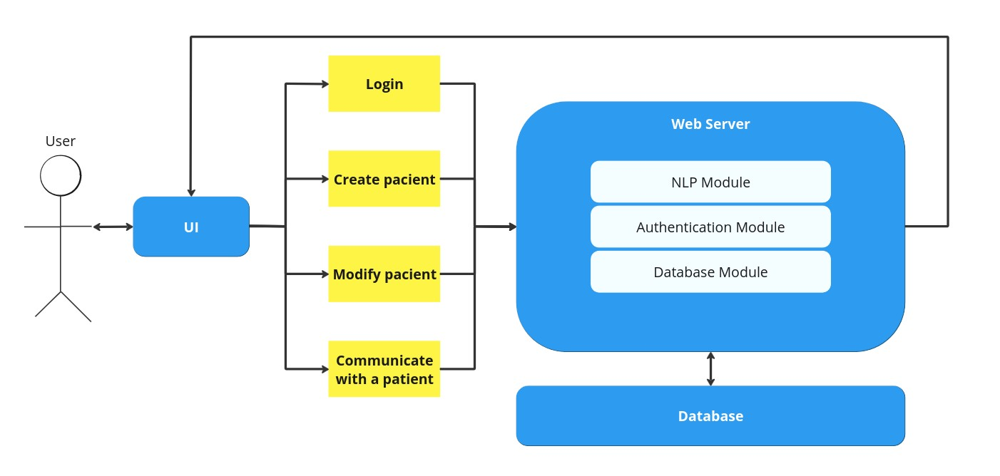
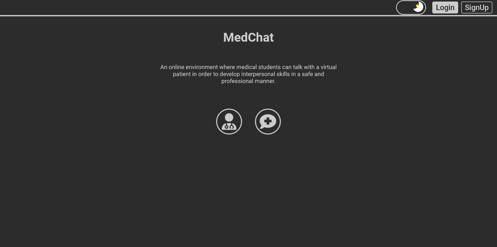
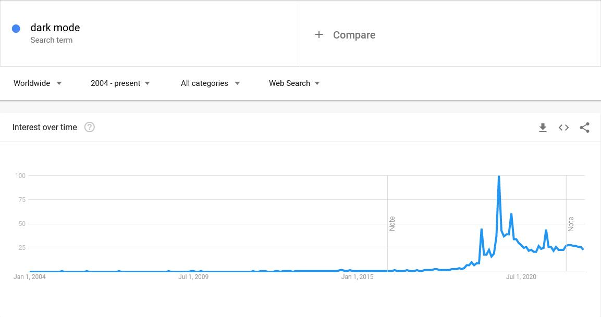
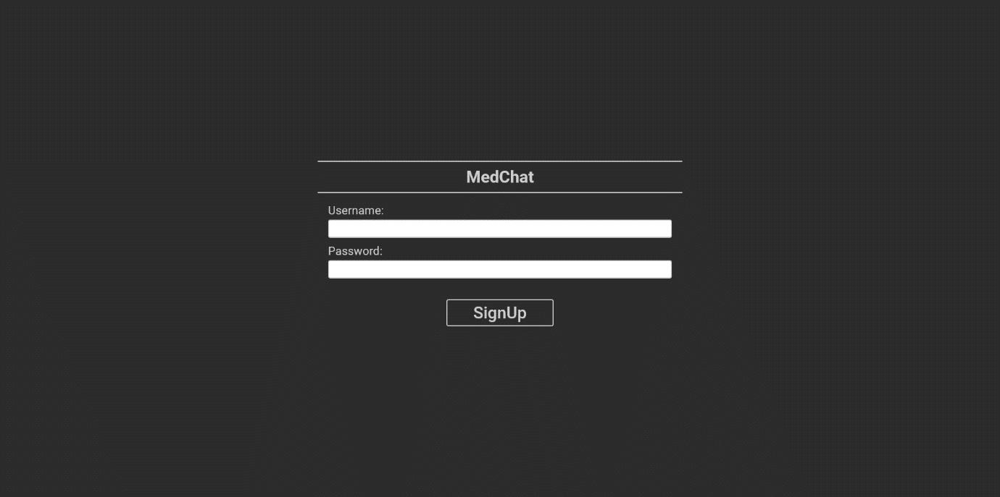
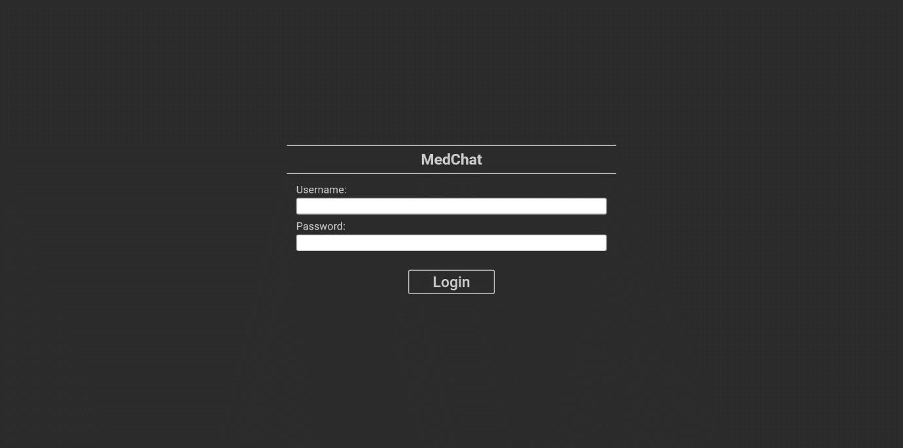
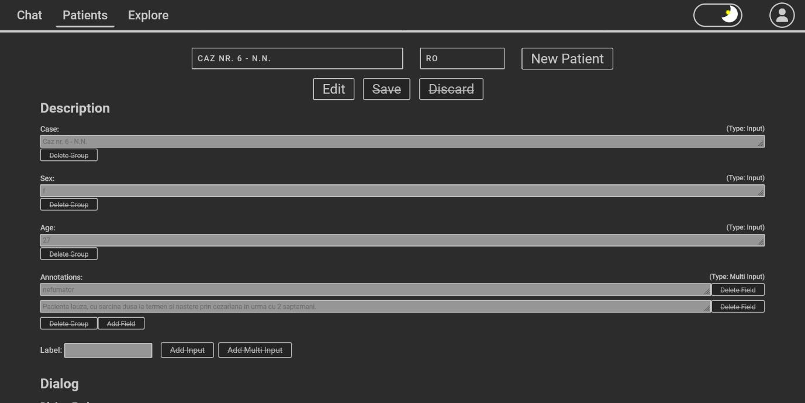
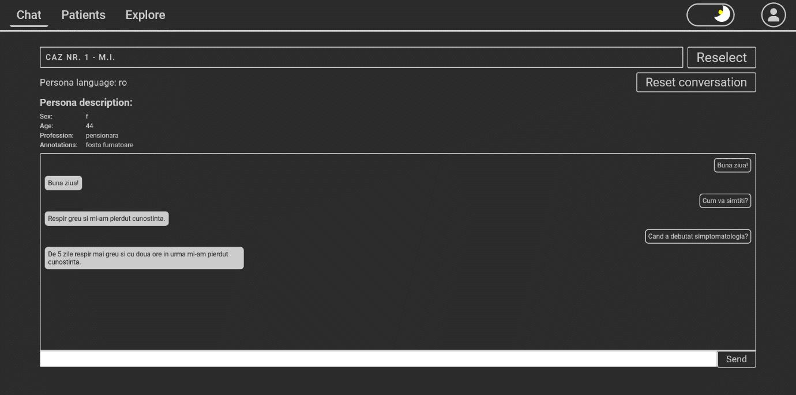
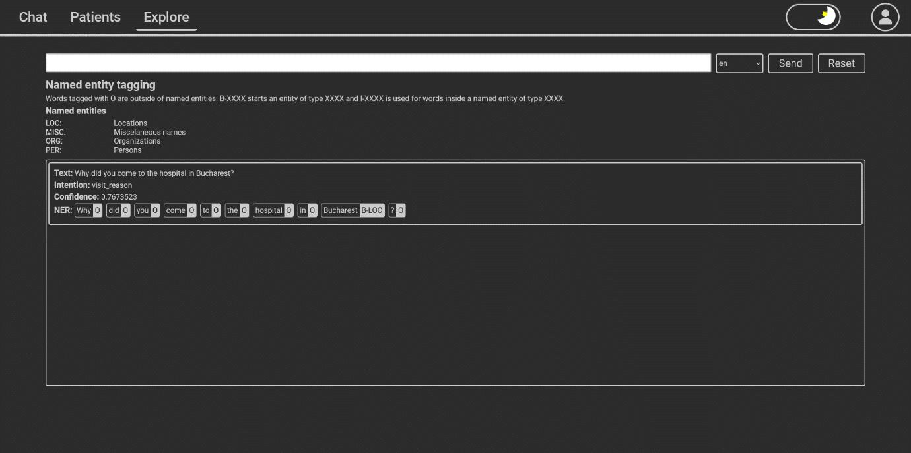

# NLP UI

This git repository is part of a project that implements a chatbot which
impersonates a patient who suffers from cardiovascular diseases.

The project consists of three repositories which contain the logic of the
application:

- Client (**this repository**)
- Server [nlp-server](https://github.com/eduard-gp/nlp-server)
- AI [nlp-ai](https://github.com/eduard-gp/nlp-ai)

## Application Arhitecture

The application has an arhitecture of client-server. There are three components:
a user interface, a web server and a database. The user interacts with the
chatbot using the UI. It is possible to perform the following actions:

- Login
- Create a new patient
- Modify the information of a patient that already exists
- Interact with a patient

The following image describes the workflow of the application:

## UI

The client application is a UI written in React which allows the user to intereact
with the chatbox.

The user will be redirected to the "Welcome Page" when he first uses the
application. Here the user will be able to read a short description of the
applciation. The navigation bar makes it possible for the user to select
between the "Login page" or "Sing-up page". Also the user can select between a
dark or light theme. This choice allows the user not to be blocked in a color
scheme that he is unhappy with. The dark theme is adopted by systems like
Android, iOS, Windows 10 and macOS, because it reduces the strees on the eyes
for long sessions in front of the screen. Furthermore, the dark colors are
usually associated with elegance. The evolution of the popularity of the dark
theme according to google trends is presented below.

The Sign-up page is used by a person to create a user account. An account allows
the user the personalize the data that is associated with his account. For
example, the user can modify a patient's information so he can answer queestions
in a specific way.

The Login page is similar with the Sign-up page. An error message will be
displayed, if the authentication information is wrong.

The Patients page is where the user can create new patients or modify the
information of an already existing patient. Every user has 15 patients that
understand the English language and 15 patients that understand the Romanian
language after he first creates a new account. The search bar can filter the
patients by name or or case. Every patients has a description and a dialog. The
description sections presents general information of a patient. The label "Case"
is used to uniquely identify a patient. There are two types of input fields:
single input and multi input. A single input is used to describe information
like "Sex" or "Age" that is uniquly described by a value and a multi input is
used to identify data that should be logically grouped. For example, the
"Annotations" could record the medical history of a patient. There is possible
to delete any type of input field (the exception is "Case", because it is used
to identify the patient) or add new types of inputs. To add a new input, the
user only has to select what type of input he wants to create and associate a
label with it. The dialog section is made of groups of question-answers pairs
that are named dialog entities which are of type multi input. Every question has
associated with it an intention. The answers associated with that questions will
be used by the chatbot as a replay. The user can ask any question that has a
similar intent to the ones presented and the chatbot will determine the intent
and select an answer. If the user doesn't want the patient to be able to answer
a question, the answers to that questions shouldn't be any answers to that
question.

The chat page is the place where the user can interact with the patient. The
first step that the user has to do is to select a patient using the search bar.
After a patient is selected, the "Send" button and the text input will be
unlbocked. The user's messages are displayed on the right and the patient's
messages on the left. When the user wants to restart the conversation, he can
press the "Reset conversation" button.

The explore page is where the user can see how the a question is processed by
the NLP module. The user has to select a language, write the question and press
the "Send button" in order to send the question to the server which is going to
analyze it. The displayed response will contain the deduced intention, the
confidence for that deduction and the tokenization of the sentence with its
associated named entity tags.
